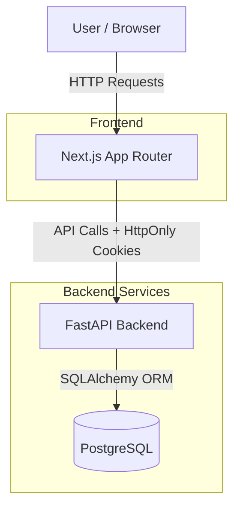
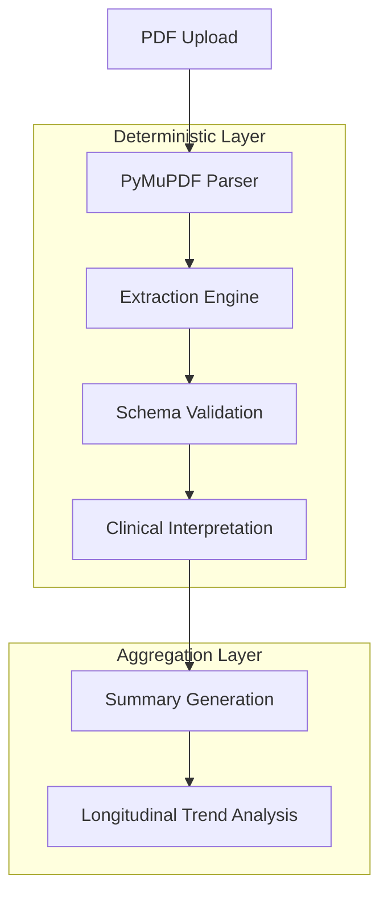

# Architecture Documentation

This document maps out the system components and internal data flows of the ClariMed platform.

## System Architecture

The overarching system is built on a modern decoupled stack featuring Next.js (Frontend), FastAPI (Backend), and PostgreSQL (Database). 

## Clinical Intelligence Pipeline

Rather than relying on non-deterministic LLMs to execute medical interpretation, ClariMed utilizes a fully deterministic processing pipeline before generating natural language summaries.

*(You can export these diagrams to create `docs/architecture.png` if needed using standard Mermaid tooling).*
