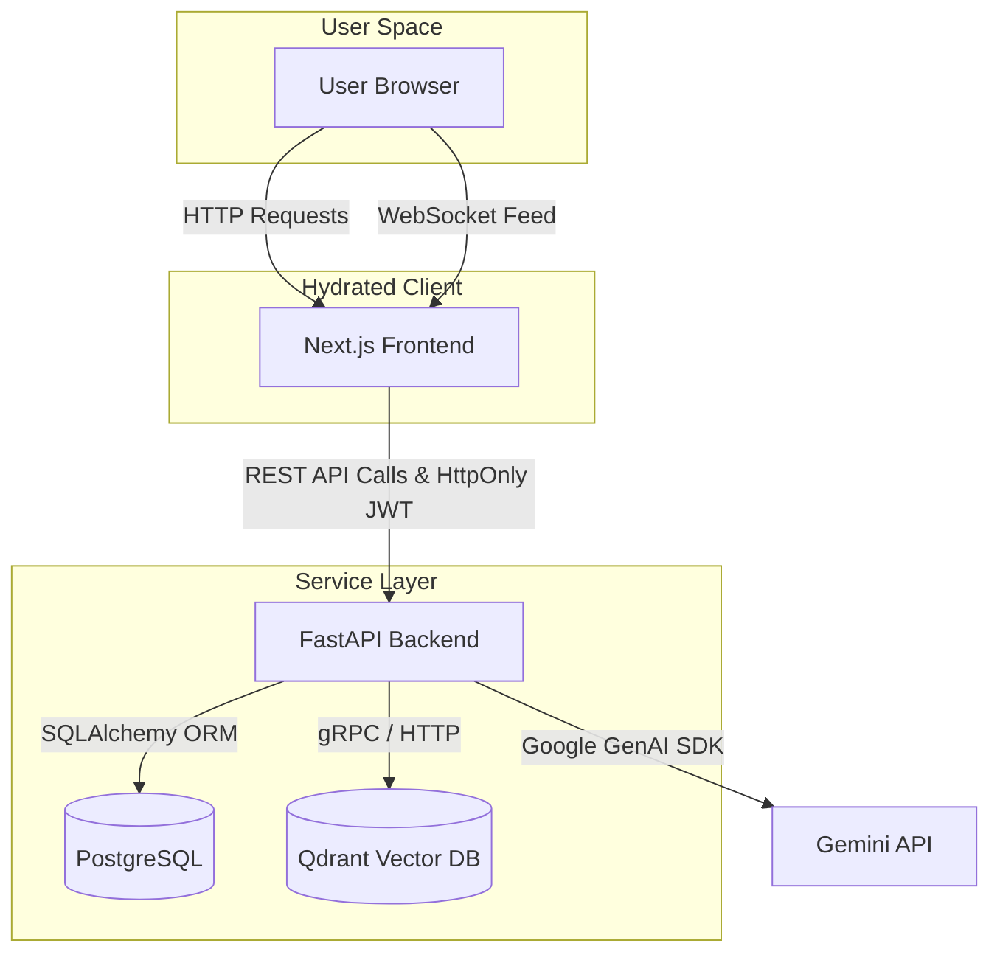
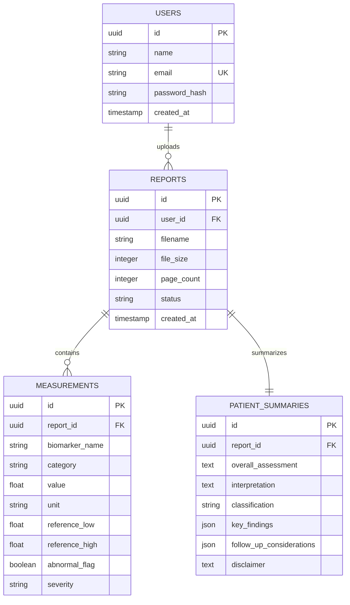
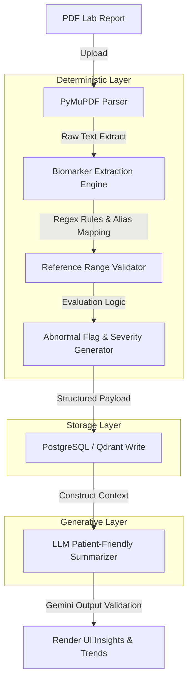
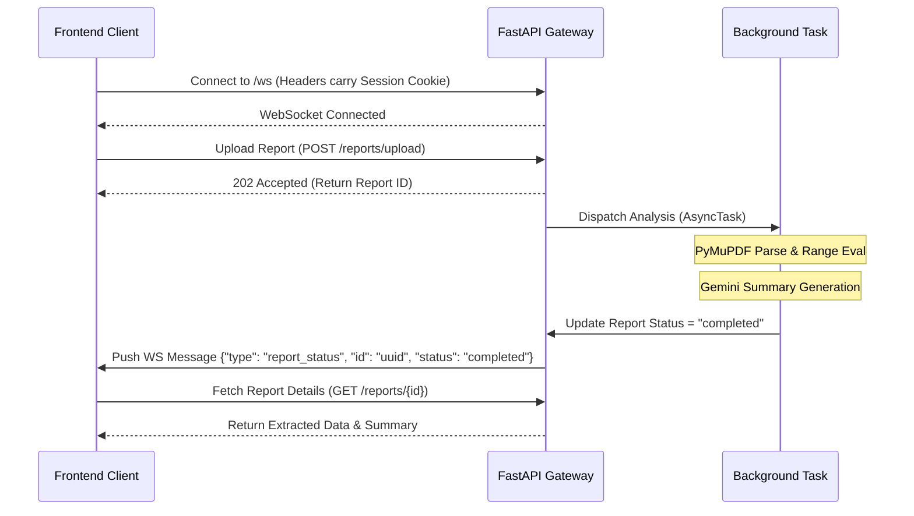

# Architectural Documentation

This document maps out the system components, data schemas, and internal data pipelines of the ClariMed platform.

---

## 1. Core System Architecture

ClariMed is structured as a decoupled full-stack platform:
1. **Frontend Client (Next.js 15):** Built with TypeScript, Tailwind CSS v4, and React components. It communicates with the backend via RESTful APIs and real-time WebSockets.
2. **Backend API (FastAPI):** Python-based API server handling business logic, user authentication (HttpOnly Cookie-based JWT), processing queues, and deterministic biomarker parsing.
3. **Database (PostgreSQL):** Relational store managed via SQLAlchemy ORM and Alembic migrations, holding users, reports, measurements, and summaries.
4. **Vector Database (Qdrant):** Vector indexing store containing parsed patient data embeddings used for semantically querying patient clinical history in the AI assistant chat.

---

## 2. Relational Database Schema

The relational database layer consists of 4 main tables:

---

## 3. Clinical Intelligence Pipeline

Rather than passing raw text directly to a generative LLM (which introduces a high risk of medical hallucination), ClariMed isolates processing into a strict deterministic phase followed by a generative/summarization phase.

### Deterministic Extraction Phase:
1. **PyMuPDF Parser:** Extracts raw character blocks and spatial coordinates from the PDF.
2. **Extraction Engine:** Scans text lines utilizing regular expressions and pre-compiled biomarker maps.
3. **Reference Range Validator:** Evaluates whether values sit within healthy boundaries (accounting for aliases, measurement standards, and flags).
4. **Severity Generator:** Categorizes abnormal bounds (e.g. `NORMAL`, `ABNORMAL`, `CRITICAL`) using standardized diagnostic thresholds.

### Generative AI Phase (Google Gemini SDK):
- Context templates are injected with the *fully structured output* generated by the deterministic layer.
- Gemini is requested to construct an empathetic, plain-language patient summary (Overall Assessment, Key Findings, and Actionable Steps).
- The prompt restricts Gemini from creating any medical conclusions or clinical numbers not present in the input context.
- **Failover Chain:** Features automated failovers (`gemini-2.5-flash` -> `gemini-1.5-flash` -> `gemini-2.0-flash`) to ensure reliable operation.

---

## 4. Real-time Notification Architecture

WebSockets are utilized to update the frontend application instantly when long-running reports finish processing:

