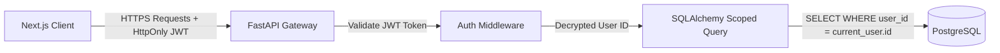

# Security & Compliance Framework

This document outlines the security controls, data access models, and regulatory compliance strategies (including HIPAA alignment) implemented in the ClariMed platform.

---

## 1. Implemented Security Controls

### Secure Session Management (HttpOnly Cookies)
ClariMed enforces secure session controls to prevent token extraction:
- **No LocalStorage Tokens:** Authentication tokens (JWTs) are never stored in client-side `localStorage` or `sessionStorage` where they are vulnerable to Cross-Site Scripting (XSS) attacks.
- **HttpOnly & Secure Flags:** Session JWTs are stored in the browser using `HttpOnly` and `Secure` cookie attributes. This prevents Javascript APIs from reading the cookies.
- **Cross-Site Request Forgery (CSRF) Mitigation:** The authentication cookie is scoped with `SameSite=Lax` to provide baseline CSRF protection for cross-origin transitions.

### Cryptographic Scopes (Access Control)
Data access is strictly scoped via backend database query isolation:
- **Token Decryption:** Incoming requests decrypt the JWT signature on the backend via HS256 using the server's secret `JWT_SECRET`.
- **Query Scoping:** User reports are queried via SQLAlchemy filters strictly matching the `current_user.id` resolved from the session:
  ```python
  # Safe, scoped query pattern
  reports = db.query(Report).filter(Report.user_id == current_user.id).all()
  ```
  It is mathematically impossible for User A to fetch, access, or edit User B's reports because database results are filtered at query-time on the server.

### Schema Validation
Payload injection and database query corruption are mitigated through dual-layer schema validation:
- **Backend (Pydantic v2):** Strongly types and parses all incoming requests, preventing SQL injection and buffer overrun attempts.
- **Frontend (Zod + React Hook Form):** Evaluates input patterns on the client before request dispatch.

---

## 2. Platform Security Architecture



---

## 3. HIPAA Staging & Production Compliance Roadmap

While the ClariMed Minimum Viable Product (MVP) implements robust baseline security protocols, the following steps must be completed to achieve full Health Insurance Portability and Accountability Act (HIPAA) compliance for US production deployment:

### 1. Data Encryption at Rest (PHI Protection)
- **Database Encryption:** Production PostgreSQL instances (e.g. AWS RDS or Neon Enterprise) must have Transparent Data Encryption (TDE) active.
- **Vector DB Encryption:** Configure encryption-at-rest on the disk volume hosting the Qdrant database.
- **Cloud Storage:** Transition local filesystem storage (`uploads/` directory) to an Amazon S3 bucket with **AWS KMS Server-Side Encryption (SSE-S3)** configured.

### 2. Encryption in Transit
- Enforce **TLS 1.3** on all external endpoints.
- Reject non-HTTPS connections at the gateway layer (e.g. Nginx or Cloudflare edge servers) using Strict-Transport-Security (HSTS) headers.

### 3. Comprehensive Audit Trail
HIPAA requires tracking every event touching Protected Health Information (PHI). We must implement an audit table in PostgreSQL to record:
- **Timestamp** of the access.
- **User ID** accessing the record.
- **Action Type** (e.g., `READ_REPORT`, `UPLOAD_REPORT`, `GENERATE_SUMMARY`, `DELETE_REPORT`).
- **IP Address** and User-Agent signature.

### 4. Vulnerability Mitigation & Rate Limiting
- Integrate **API rate limiting** middleware on endpoints like `/auth/login`, `/auth/register`, and `/reports/upload` to prevent Denial of Service (DoS) and credentials testing.
- Disable Swagger documentation (`/docs` and `/redoc`) in production to prevent vulnerability scans.
